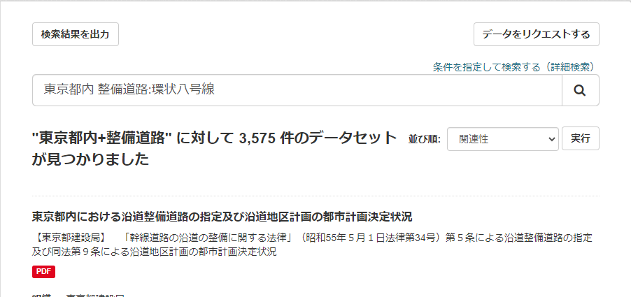
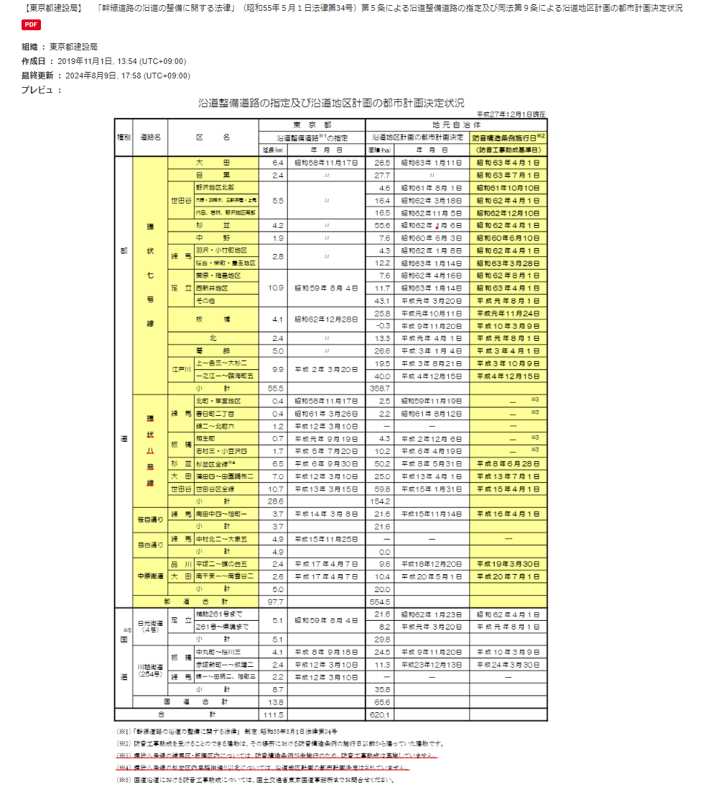
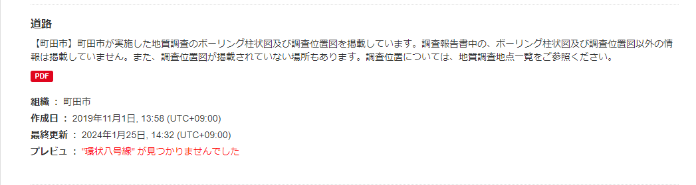
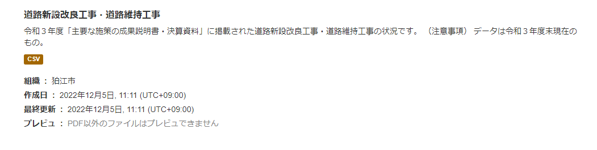

# 東京都オーペンデータカタログサイト 検索性能向上 Chrome拡張機能

## インストール (Install)

1. 先ずはこのプロジェクトをクローンしてください。

```bash
git clone https://github.com/kannagiakihiro/metro-catalog-crx.git
```

2. 次に、Chromeのアドレスバーに「chrome://extensions/」を入力してください。

3. 右上角の「デベロッパーモード」を有効にしてください。
4. パッケージ化されていない拡張機能を読み込む
5. 左上角の「パッケージ化されていない拡張機能を読み込む」ボタンをクリックしてください。
6. リポジトリの「install」ディレクトリを選択してください: `metro-catalog-crx/install` 
7. すこし待ってください。拡張機能がインストールされます。

## 使い方 (How to use)

1. 東京都オーペンデータカタログサイトにアクセスしてください。

`https://catalog.data.metro.tokyo.lg.jp/dataset`

2. 検索ボックスに通常検索したい内容を入力し、その後に「コロン」とPDFファイル内で検索したい内容を追加してください。たとえば、以下のように入力してください。

`東京都内 整備道路：環状八号線`


3. マチングした結果は、プレビュー画面に表示されます。PDFファイル内の検索結果は、赤い線にハイライトされます。


4. マチングしなかった場合は、以下のように表示されます。


5. PDF以外のファイルには対応していません。また、PDFファイルの検索は、PDF.jsを使用しています。そのため、PDFファイルの構造によっては、正しく検索できない場合があります。

